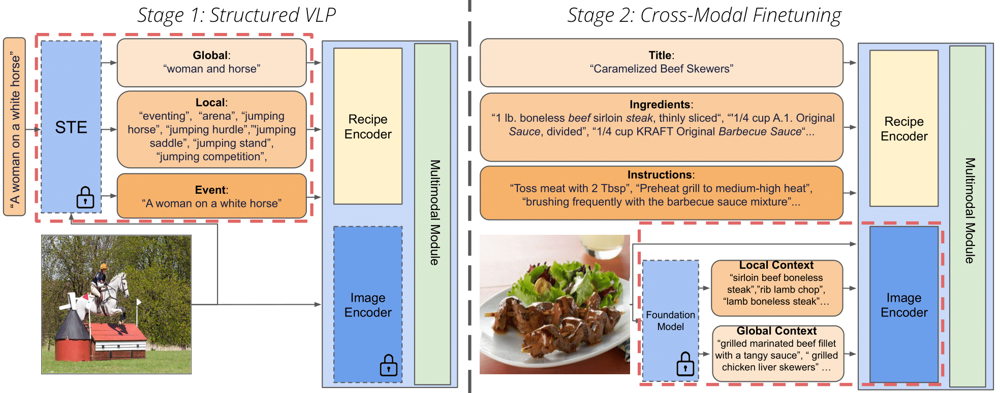
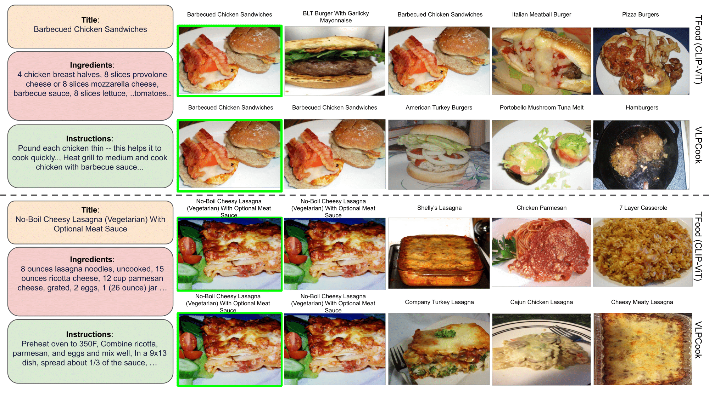

# VLPCook
Official implementation of the paper: 
- [Vision and Structured-Language Pretraining for Cross-Modal Food Retrieval](https://arxiv.org/abs/2212.04267)

In this repo, you will find the pretrained models and code to train and evaluate VLPCook for Cross-Modal Food Retrieval.

[](https://paperswithcode.com/sota/cross-modal-retrieval-on-recipe1m?p=structured-vision-language-pretraining-for)

[](https://paperswithcode.com/sota/cross-modal-retrieval-on-recipe1m-1?p=structured-vision-language-pretraining-for)


### Summary:

* [Introduction](#introduction)
* [Installation](#installation)
* [Download and Prepare Datasets](#download-and-prepare-datasets)
* [Download Pretrained Models](#download-pretrained-models)
* [Training](#training)
* [Evaluation](#evaluation)
* [Citation](#citation)
* [Acknowledgment](#acknowledgment)

## Introduction

Vision-Language Pretraining (VLP) and Foundation models have been the go-to recipe for achieving SoTA performance on general benchmarks. However, leveraging these powerful techniques for more complex vision-language tasks, such as cooking applications, with more structured input data, is still little investigated.
In this work, we propose to leverage these techniques for structured-text based computational cuisine tasks.  Our strategy, dubbed VLPCook, first transforms existing image-text pairs to image and structured-text pairs. This allows to pretrain our VLPCook model using VLP objectives adapted to the strutured data of the resulting datasets, then finetuning it on downstream computational cooking tasks. During finetuning, we also enrich the visual encoder, leveraging pretrained foundation models (e.g. CLIP) to provide local and global textual context. VLPCook outperforms current SoTA by a significant margin (+3.3 Recall@1 absolute improvement) on the task of Cross-Modal Food Retrieval on the large Recipe1M dataset. We conduct further experiments on VLP to validate their importance, especially on the Recipe1M+ dataset. Finally, we validate the generalization of the approach to other tasks (i.e, Food Recognition) and domains with structured text such as the Medical domain on the ROCO dataset. 

<p align="center">
    
</p>


### Qualitative Results


<p align="center">
    
</p>

> Recipe-to-image comparison on the Recipe1M test set, 1k setup. TFood (first and third rows) vs. our VLPCook (second and fourth rows). The image in green is the ground truth, followed by the top 4 retrieved images in order. One can notice that our VLPCook approach  better captures some finegrained details (type of meat) and most of the retrieved images are semantically similar.
## Installation

Main requirements: Pytorch 1.7, clip, timm.

First create the conda environment from the `env.yaml` file:

```
conda env create --name vlpcook --file=env/env.yaml
source activate vlpcook
```

We use a [bootstrap.pytorch](https://github.com/Cadene/bootstrap.pytorch.git) as a high level framework, we made a slight modifications to the original repo, to install the correct one in developpement mode:
```
cd bootstrap.pytorch
pip install -e .
```

You need also to install clip from the original [repo](https://github.com/openai/CLIP):
```
pip install git+https://github.com/openai/CLIP.git
```


## Download and Prepare Datasets

Please, create an account on http://im2recipe.csail.mit.edu/ to download the dataset.

Create a directory (`data_dir`) to download the dataset.

First download the `Layers` in `data_dir` and tokenize layer1:
```
python preprocess/create_tokenized_layer.py --path_layer data_dir/recipe1m/layer1.json --output_path_vocab data_dir/recipe1m/text/vocab_all.txt --output_path_layer1 data_dir/recipe1m/text/tokenized_layer_1.json --output_path_tokenized_texts data_dir/recipe1m/text
```
Download `data.h5` in `data_dir`, unzip it and and create the lmdb files:

```
python preprocess/h5py_to_lmdb.py --dir_data data_dir
```

Optional: Download the images and put them in `data_dir/recipe1M/images`.

Download `classes1M.pkl`, and place the file in `data_dir`.

### Download Processed Data

You can downoload the processed data from [here](https://data.isir.upmc.fr/vlpcook/data/).


The `ids` are the ids for all recipe1m13 examples except those in the validation and test set of recipe1m,  `ids_original` are the original recipe13m train, validation and test split and used during training on Recipe1M+


We will put later the details to construct and preprocess the data ...

### Data organization

The `data_dir` should be organized as follows:

```
data_dir:
    recipe1m:
        text:
            vocab_all.txt
            vocab.pkl
            tokenized_layer1.json
        context_annotation:
            # for Recipe1M
            layer1_train_titles_kw.json
            layer1_val_titles_kw.json
            layer1_test_titles_kw.json
            layer1_train_ingr_kw.json
            layer1_test_ingr_kw.json
            layer1_val_ingr_kw.json
            # for Recipe1M+
            layer1_recipe1m_13m_train_titles_kw.json
            layer1_recipe1m_13m_val_titles_kw.json
            layer1_recipe1m_13m_test_titles_kw.json
            layer1_recipe1m_13m_train_ingr_kw.json
            layer1_recipe1m_13m_val_ingr_kw.json
            layer1_recipe1m_13m_test_ingr_kw.json
        recipe1m_13m:
            layer2+.json
            ids.json
            original_ids.json
    Recipe1M+:
        images_recipe1M+
    pretrain_json:
        coco_ttl_kw.json    
        sbu_ttl_kw.json
        vg_albef_ttl_kw.json
    coco:
        val2014
        train2014  
        test2015     
    sbu:
        images_train:
            00000
            00001
            ...
    visual_genome:
            annotations
            images: 
                VG_100K
                VG_100K_2
```

## Download Pretrained Models

You can downoload the pretrained weights and logs to test the model from [here](https://data.isir.upmc.fr/vlpcook/pretrained_models/).
For testing our pretrained models, you can also download the tokenized layer1.

## Training

The [boostrap/run.py](https://github.com/Cadene/bootstrap.pytorch/blob/master/bootstrap/run.py) file load the options contained in a yaml file, create the corresponding experiment directory (in exp/dir) and start the training procedure.


Several files are going to be created in `log_dir/exp_name`:
- options.yaml (copy of options)
- logs.txt (history of print)
- logs.json (batchs and epochs statistics)
- view.html (learning curves)
- ckpt_last_engine.pth.tar (checkpoints of last epoch)
- ckpt_last_model.pth.tar
- ckpt_last_optimizer.pth.tar
- ckpt_best_eval_epoch.metric.recall_at_1_im2recipe_mean_engine.pth.tar (checkpoints of best epoch)
- ckpt_best_eval_epoch.metric.recall_at_1_im2recipe_mean_model.pth.tar
- ckpt_best_eval_epoch.metric.recall_at_1_im2recipe_mean_optimizer.pth.tar

To resume a training you can pass `--exp.resume last` as argument instead of `--misc.overrite true`.

### Pretraining

#### On IST (COCO, SBU, VG)

You can pretrain our model with 4 A100 (40 Gb) GPUs on IST dataset by running:
```
CUDA_VISIBLE_DEVICES=0,1,2,3 python -m bootstrap.run -o options/vlpcook_pretrain.yaml \
--misc.data_parrallel true \
--dataset.batch_size 200 \
--dataset.dir data_dir  \
--exp.dir log_dir/exp_name \
--dataset.data_json_dir data_dir/pretrain_json \
--misc.overrite true
```

#### On Recipe1M+

You can pretrain our model with 4 A100 (40 Gb) GPUs on Recipe1M+ dataset by running:

```
CUDA_VISIBLE_DEVICES=0,1,2,3 python -m bootstrap.run -o options/vlpcook_pretrain_rec13m.yaml \
--exp.dir log_dir/exp_name \
--dataset.dir data_dir/Recipe1M+/images_recipe1M+  \
--misc.data_parrallel true  \
--dataset.batch_size 100 \
--model.network.path_vocab data_dir/recipe1m/text/vocab_all.txt \
--model.network.path_ingrs data_dir/recipe1m/text/vocab.pkl \
--dataset.path_image_json data_dir/recipe1m/recipe1m_13m/layer2+.json \
--dataset.path_ids data_dir/recipe1m/recipe1m_13m/ids.json \
--dataset.path_text_json data_dir/recipe1m/text/tokenized_layer1.json \
--dataset.vocab_path data_dir/recipe1m/text/vocab_all.txt \
--misc.overrite true
```
### Finetuning on Recipe1M

Then you can finetune the model on Recipe1M by running:

```
CUDA_VISIBLE_DEVICES=0,1 python -m bootstrap.run -o options/vlpcook_clip_finetune.yaml \
--misc.data_parrallel true \
--dataset.batch_size 100 \
--dataset.dir data_dir/recipe1m  \
--exp.dir log_dir/exp_name \
--model.network.path_vocab data_dir/recipe1m/text/vocab_all.txt \
--model.network.path_ingrs data_dir/recipe1m/text/vocab.pkl \
--dataset.aux_kw_path.train data_dir/recipe1m/context_annotation/layer1_train_titles_kw.json \
--dataset.aux_kw_path.test data_dir/recipe1m/context_annotation/layer1_test_titles_kw.json \
--dataset.aux_kw_path.val data_dir/recipe1m/context_annotation/layer1_val_titles_kw.json \
--model.network.bert_config ~/vlpcook/recipe1m/models/networks/recipe_networks/config_bert_albef.json \
--dataset.randkw_p 0.3 \
--dataset.kw_path.train data_dir/recipe1m/context_annotation/layer1_train_ingr_kw.json \
--dataset.kw_path.test data_dir/recipe1m/context_annotation/layer1_test_ingr_kw.json \
--dataset.kw_path.val data_dir/recipe1m/context_annotation/layer1_val_ingr_kw.json \
--dataset.randkw_p_aux 0.5 \
--exp.checkpoint log_dir/pretrain_exp_name/ckpt_last_model.pth.tar \
--misc.overrite true
```
Use `vlpcook_clip_finetune_rec13m.yaml` if you intialize with model pretrained on Recipe1M+.

### Training on Recipe1M+

To train the model on Recipe1M+ you can run:

```
CUDA_VISIBLE_DEVICES=0,1 python -m bootstrap.run -o options/vlpcook_clip_train_rec13m.yaml \
--exp.dir log_dir/exp_name \
--dataset.dir data_dir/Recipe1M+/images_recipe1M+  \
--misc.data_parrallel true  \
--dataset.batch_size 96 \
--model.network.path_vocab data_dir/recipe1m/text/vocab_all.txt \
--model.network.path_ingrs data_dir/recipe1m/text/vocab.pkl \
--dataset.path_image_json data_dir/recipe1m/recipe1m_13m/layer2+.json \
--dataset.path_ids data_dir/recipe1m/recipe1m_13m/original_ids.json \
--dataset.path_text_json data_dir/recipe1m/text/tokenized_layer1.json \
--dataset.vocab_path data_dir/recipe1m/text/vocab_all.txt \
--model.network.bert_config ~/tfood/recipe1m/models/networks/recipe_networks/config_bert_albef.json \
--dataset.aux_kw_path.train data_dir/recipe1m/context_annotation/layer1_recipe1m_13m_train_titles_kw.json \
--dataset.aux_kw_path.test data_dir/recipe1m/context_annotation/layer1_recipe1m_13m_test_titles_kw.json \
--dataset.aux_kw_path.val data_dir/recipe1m/context_annotation/layer1_recipe1m_13m_val_titles_kw.json \
--model.network.bert_config ~/vlpcook/recipe1m/models/networks/recipe_networks/config_bert_albef.json \
--dataset.randkw_p 0.3 \
--dataset.kw_path.train data_dir/recipe1m/context_annotation/layer1_recipe1m_13m_train_ingr_kw.json \
--dataset.kw_path.test data_dir/recipe1m/context_annotation/layer1_recipe1m_13m_test_ingr_kw.json \
--dataset.kw_path.val data_dir/recipe1m/context_annotation/layer1_recipe1m_13m_val_ingr_kw.json \
--dataset.randkw_p_aux 0.5 \
--misc.overrite true
```
## Evaluation

You can evaluate your model on the testing set. [boostrap/run.py](https://github.com/Cadene/bootstrap.pytorch/blob/master/bootstrap/run.py) loads the options from your experiment directory, resume the best checkpoint on the validation set and start an evaluation on the testing set instead of the validation set while skipping the training set (train_split is empty).

### Evaluate on Recipe1M

```
CUDA_VISIBLE_DEVICES=0 python -m bootstrap.run -o options/vlpcook_clip_finetune.yaml \
--dataset.batch_size 100 \
--dataset.dir data_dir/recipe1m  \
--exp.dirlog_dir/exp_name \
--model.network.path_vocab data_dir/recipe1m/text/vocab_all.txt \
--model.network.path_ingrs data_dir/recipe1m/text/vocab.pkl \
--dataset.aux_kw_path.train data_dir/recipe1m/context_annotation/layer1_train_titles_kw.json \
--dataset.aux_kw_path.test data_dir/recipe1m/context_annotation/layer1_test_titles_kw.json \
--dataset.aux_kw_path.val data_dir/recipe1m/context_annotation/layer1_val_titles_kw.json \
--model.network.bert_config ~/vlpcook/recipe1m/models/networks/recipe_networks/config_bert_albef.json \
--dataset.randkw_p 0.3 \
--dataset.kw_path.train data_dir/recipe1m/context_annotation/layer1_train_ingr_kw.json \
--dataset.kw_path.test data_dir/recipe1m/context_annotation/layer1_test_ingr_kw.json \
--dataset.kw_path.val data_dir/recipe1m/context_annotation/layer1_val_ingr_kw.json \
--dataset.randkw_p_aux 0.5 \
--dataset.eval_split test \
--dataset.train_split \
--exp.resume best_eval_epoch.metric.recall_at_1_im2recipe_mean \
--model.metric.nb_bags 10 \
--model.metric.nb_matchs_per_bag 1000 \
--model.metric.trijoint true 
```

### Evaluate on Recipe1M+

```
CUDA_VISIBLE_DEVICES=0 python -m bootstrap.run -o options/vlpcook_clip_train_rec13m.yaml \
--exp.dir log_dir/exp_name \
--dataset.dir data_dir/Recipe1M+/images_recipe1M+  \
--misc.data_parrallel true  \
--dataset.batch_size 100 \
--model.network.path_vocab data_dir/recipe1m/text/vocab_all.txt \
--model.network.path_ingrs data_dir/recipe1m/text/vocab.pkl \
--dataset.path_image_json data_dir/recipe1m/recipe1m_13m/layer2+.json \
--dataset.path_ids data_dir/recipe1m/recipe1m_13m/original_ids.json \
--dataset.path_text_json data_dir/recipe1m/text/tokenized_layer1.json \
--dataset.vocab_path data_dir/recipe1m/text/vocab_all.txt \
--model.network.bert_config ~/tfood/recipe1m/models/networks/recipe_networks/config_bert_albef.json \
--dataset.aux_kw_path.train data_dir/recipe1m/context_annotation/layer1_recipe1m_13m_train_titles_kw.json \
--dataset.aux_kw_path.test data_dir/recipe1m/context_annotation/layer1_recipe1m_13m_test_titles_kw.json \
--dataset.aux_kw_path.val data_dir/recipe1m/context_annotation/layer1_recipe1m_13m_val_titles_kw.json \
--model.network.bert_config ~/vlpcook/recipe1m/models/networks/recipe_networks/config_bert_albef.json \
--dataset.randkw_p 0.3 \
--dataset.kw_path.train data_dir/recipe1m/context_annotation/layer1_recipe1m_13m_train_ingr_kw.json \
--dataset.kw_path.test data_dir/recipe1m/context_annotation/layer1_recipe1m_13m_test_ingr_kw.json \
--dataset.kw_path.val data_dir/recipe1m/context_annotation/layer1_recipe1m_13m_val_ingr_kw.json \
--dataset.randkw_p_aux 0.5 \
--dataset.eval_split test \
--dataset.train_split \
--exp.resume best_eval_epoch.metric.recall_at_1_im2recipe_mean \
--model.metric.nb_bags 10 \
--model.metric.nb_matchs_per_bag 1000 \
--model.metric.trijoint true 

```

By default, the model is evaluated on the 1k setup, to evaluate on the 10k setup you can change `--model.metric.nb_bags` to 5 and  `--model.metric.nb_matchs_per_bag` to 10000.


## Citation

```
@article{shukor2022structured,
  title={Structured Vision-Language Pretraining for Computational Cooking},
  author={Shukor, Mustafa and Thome, Nicolas and Cord, Matthieu},
  journal={arXiv preprint arXiv:2212.04267},
  year={2022}
}
```
## Acknowledgment

The code is based on the original code of [TFood](https://github.com/mshukor/TFood) and [Adamine](https://github.com/Cadene/recipe1m.bootstrap.pytorch). Some code was borrowed from [ALBEF](https://github.com/salesforce/ALBEF), [CLIP](https://github.com/openai/CLIP) and [timm](https://github.com/rwightman/pytorch-image-models).
